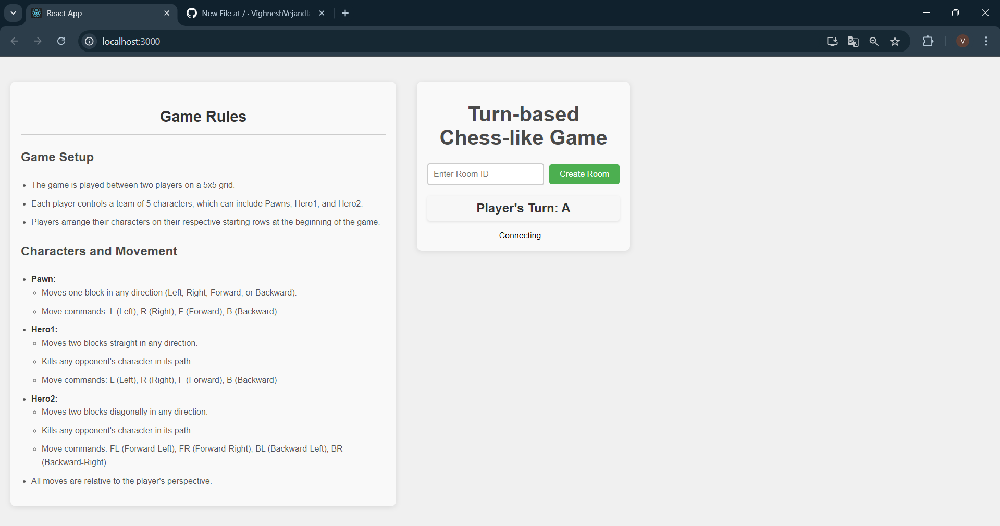
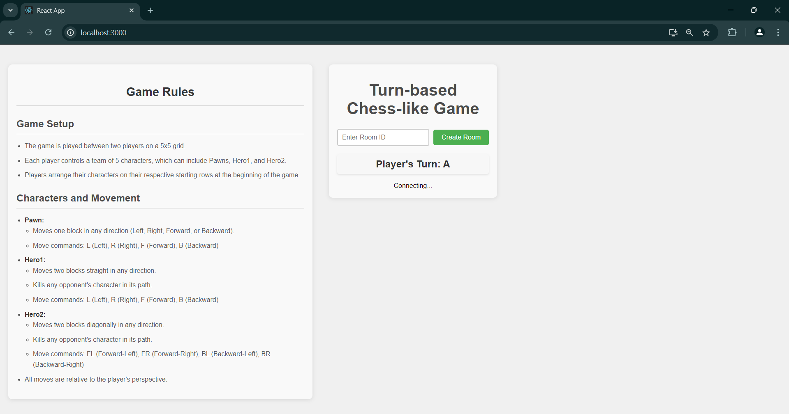
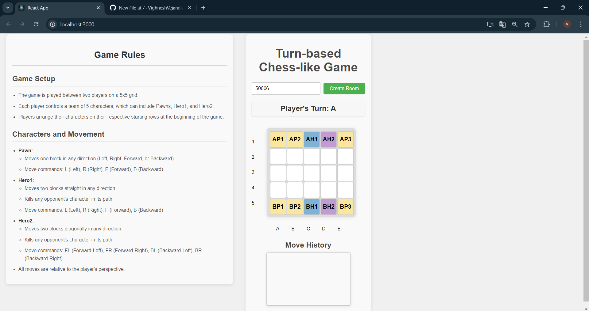
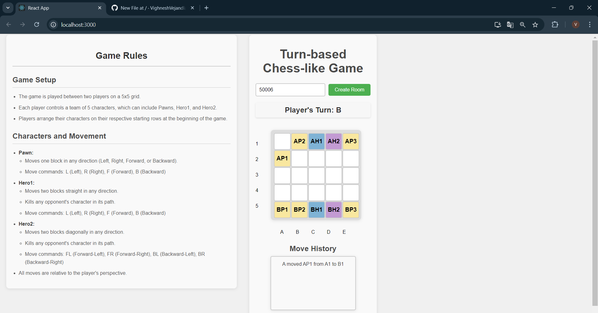
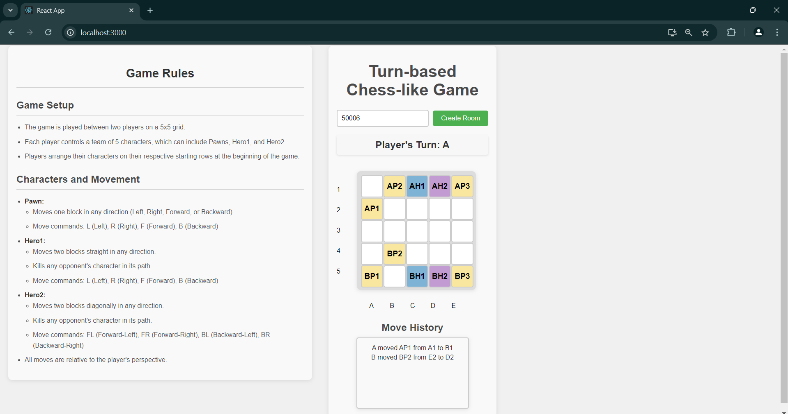
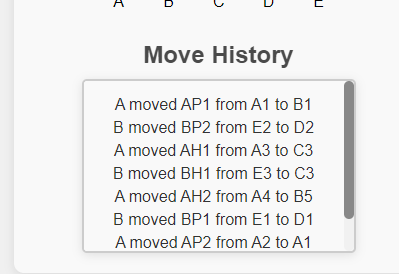
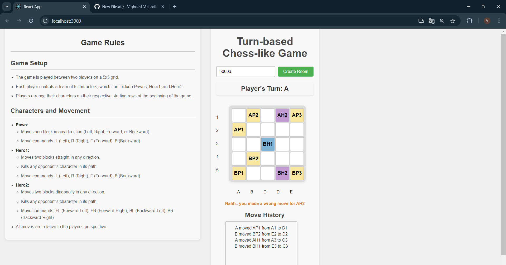
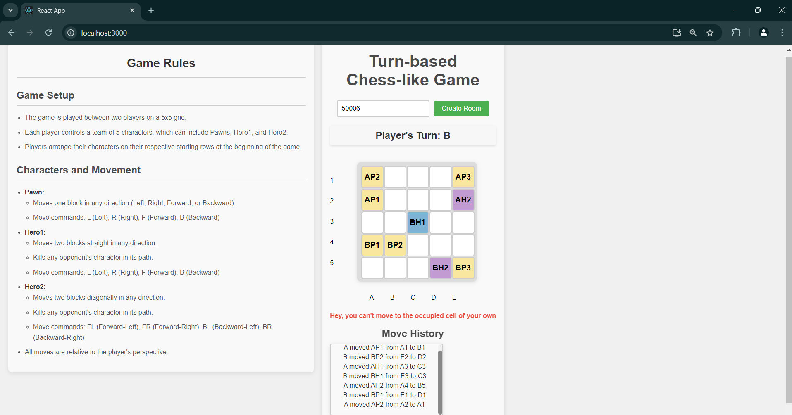

# 🎮 Turn-Based Chess-Like Game

Welcome to the *Turn-Based Chess-Like Game!* 🏆 This game is a strategic, turn-based challenge set on a 5x5 grid where players maneuver characters with distinct movement patterns. Below, you'll find all the information you need to dive in and start playing.
## 🚀 Features

- *Multiplayer Support*: Play with friends in real-time using WebSocket connections.
- *Turn-Based Gameplay*: Alternate turns with your opponent, making strategic moves.
- *Character Variety*: Control Pawns and Heroes, each with unique movement patterns.
- *Chat Functionality*: Communicate with your opponent during the game.
- *Game Rules Display*: Toggle view to see the game rules and guidelines.

## 📦 Installation

To set up the game locally:

1. *Clone the repository*:

   ``` bash
    git clone https://github.com/VighneshVejandla/21bce7609
   ``` 

2. *Go to Client folder*:

   ``` bash
    cd client
    ```

3. *Install dependencies and start*:

   ``` bash
    npm install
    npm start
   ```

5. *Go to server2 folder*:

   ```  bash
    cd server2
   ```

6. *Install dependencies and start server*:

   ``` bash
    npm install
    npm start
   ```
    
## 🖼 Screenshots

### 1. Game Lobby



The game lobby where players can join or create a room.



### 2. Game Board - Initial Setup



The initial setup of the game board with characters placed.


### 3. Player's Turn



Displays which player's turn it is and the current game state.



### 4. Move History



The move history showing all the actions taken during the game.

### 5. Invalid moves



The Invalid moves or wrong moves cna be seen under the grid

### 6. Moving a character to same player character



A message will be show under the grid if we move the charater to the place of ssame palyers character.


## 📫 Contact

For any inquiries or feedback, please reach out to me at [vighneshvejandla900@gmail.com](mailto:vighneshvejandla900@gmail.com).

---

Enjoy the game and may the best strategist win! 🎉
