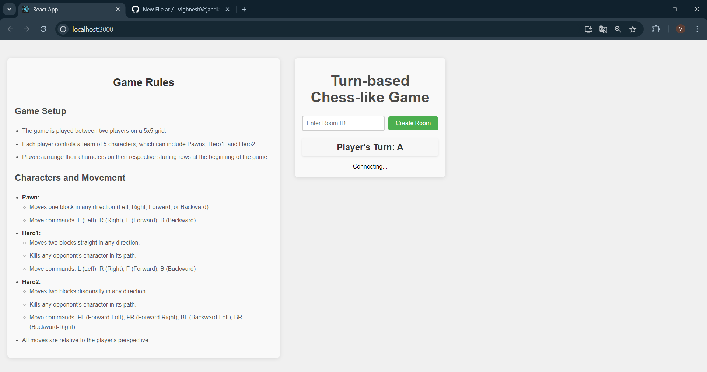

# 🎮 Turn-Based Chess-Like Game

Welcome to the *Turn-Based Chess-Like Game!* 🏆 This game is a strategic, turn-based challenge set on a 5x5 grid where players maneuver characters with distinct movement patterns. Below, you'll find all the information you need to dive in and start playing.
## 🚀 Features

- *Multiplayer Support*: Play with friends in real-time using WebSocket connections.
- *Turn-Based Gameplay*: Alternate turns with your opponent, making strategic moves.
- *Character Variety*: Control Pawns and Heroes, each with unique movement patterns.
- *Chat Functionality*: Communicate with your opponent during the game.
- *Game Rules Display*: Toggle view to see the game rules and guidelines.

## 📦 Installation

To set up the game locally:

1. *Clone the repository*:

    bash
    git clone https://github.com/VighneshVejandla/21bce7609
    

2. *Go to Client folder*:

    bash
    cd client
    

3. *Install dependencies and start*:

    bash
    npm install
    npm start

5. *Go to server2 folder*:

    bash
    cd server2

6. *Install dependencies and start server*:

    bash
    npm install
    npm start

    
## 🖼 Screenshots

### 1. Game Lobby

The game lobby where players can join or create a room.

### 2. Game Board - Initial Setup

The initial setup of the game board with characters placed.

### 3. Player's Turn

Displays which player's turn it is and the current game state.

### 4. Move History

The move history showing all the actions taken during the game.

### 5. Chat Interface

The chat interface for communicating with the opponent.

### 6. Game Rules Toggle

The section showing game rules, which can be toggled on or off.

### 7. Winning Screen

The winning screen displayed when a player wins the game.

### 8. Settings Menu

The settings menu for configuring game preferences.

### 9. Character Selection

The screen where players select their characters before starting the game.

### 10. End Game Summary

Summary of the game showing final scores and details.
## 📜 License

This project is licensed under the MIT License - see the [LICENSE](LICENSE) file for details.

## 🙋‍♂ Contributing

Feel free to submit issues or pull requests if you have improvements or bug fixes.

## 📫 Contact

For any inquiries or feedback, please reach out to me at [your-email@example.com](mailto:your-email@example.com).

---

Enjoy the game and may the best strategist win! 🎉
